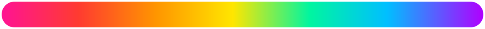

# 🌈✨🩷 ＫＥＹＷＩ 🩷✨🌈

### ✨･ﾟ:* ＷＡＩＴ　ＯＮ　ＭＥ *:･ﾟ✨

Fork of the incredible [Thumb-Key](https://github.com/dessalines/thumb-key) (itself an open source community driven conceptual fork of the late MessagEase).

But drenched in **Hyper Garrish & Violently Chromatic** (and admittedly vibecoded) vomit.

Because I wanted **These Features** in my keyboard 😄

Only here to manage the codebase & share with anyone else craving some post-material **𝓳𝓮 𝓷𝓮 𝓼𝓪𝓲𝓼 𝓺𝓾𝓸𝓲** on their most baselayer plugin to extrapersonal communications.

(Plus aiming to eventually learn from the project, hopefully on a stronger level since it's a thing I like & want & not some tutorialesque ugly To Do list app I'll forget about thinking about before lunch.)

🌈　✨　🌈　✨　🌈

You probably already know the basics.

If not, check out the [origin project](https://github.com/dessalines/thumb-key).

# ✨🌈 Here's what's new here 🌈✨

### 🎨 **Hyper-customized theming**

A whole pile of additional ways to make the keyboard look however the hell you want:

- 🌈 Gradient keyboard backgrounds
- 🖼️ Image backgrounds
- 🎞️ Animated GIF backgrounds
- 🫥 Background opacity / transparency controls
- 🎨 Separately customizable keyboard & toolbar backgrounds
- 💎 Glass / translucent visual elements
- 🌈 Customizable key backgrounds / surfaces
- ✨ Gradient & metallic key borders
- 🔤 Custom keyboard fonts
- 🫧 Customizable suggestion-bar visuals & animation
- 🪩 More controls collected into an Advanced Look & Feel area instead of limiting theming to a couple predefined styles

### 🗺️ **Visual, easier keymapper**

A more visual & approachable way to customize what the keys actually do and where things live.

### 🧠 **Context management** *(imminent)*

Advanced context/input management infrastructure for controlling how Keywi behaves depending on what & where you're typing.

### ✨ **Formatting** *(imminent)*

Keyboard-accessible text formatting & transformations, including Fancy Text / Unicode transformations without having to stop typing and wander off to another app/site.

### `(ﾉ◕ヮ◕)ﾉ*:･ﾟ✧` **KAOMOJI LIBRARY** *(imminent)*

Kaomoji as an actual keyboard input mode/library rather than something you have to hunt down, remember, or copy/paste from somewhere else.

Including the planned **ABC → Emoji → Kaomoji → ABC** cycling & prebuilt multi-character arrays.

### 𝕌 **Unicode library / support** *(imminent)*

Making Unicode shenanigannery considerably easier to actually use:

**𝕱𝖆𝖓𝖈𝖞** · **𝓕𝓪𝓷𝓬𝔂** · **Ｆａｎｃｙ** · **Ⓕⓐⓝⓒⓨ** · **ғᴀɴᴄʏ**

Including support for only showing transformations that can properly represent the selected text, plus advanced controls for exposing otherwise field-invalid characters / Unicode when desired.

### 🖼️✨ **Stickers!** *(imminent)*

**Stickers!**

### ✨ **Suggestion / Tool bar expansion** *(in work)*

Turning that suggestion/tool area into somewhere actual keyboard tools can live — including Formatting, Kaomoji, Unicode, context tools & other input utilities.

### ↵ **Advanced input controls** *(in work)*

More control over input behavior such as **Enter vs. Send**, field-aware behavior & other things that shouldn't necessarily be decided for you by one universal keyboard setting.

### 🔮 **Other in-work perversions & pizazz**

Any of the other in-work perversions and pizazz we've added to the core infrastructure as Keywi gradually becomes less of a recolored Thumb-Key and more of its own increasingly strange creature.

# 🌈 Again, vibecoded.

Not trying to make it **A Big Thing** or **Major Project** with an outwards facing model...

Just using the tools at my disposal to make the things I want as I see fit ☺

& I encourage others to do the same.

 

## ✨🌈 always make at least twice 🌈✨

### once to make it real

### once to make it good

🩷 ══ 🧡 ══ 💛 ══ 💚 ══ 🩵 ══ 💙 ══ 💜

### dont let obsessions over step 2 lock you out of taking step 1 ;}

✨ `(づ｡◕‿‿◕｡)づ` ✨

